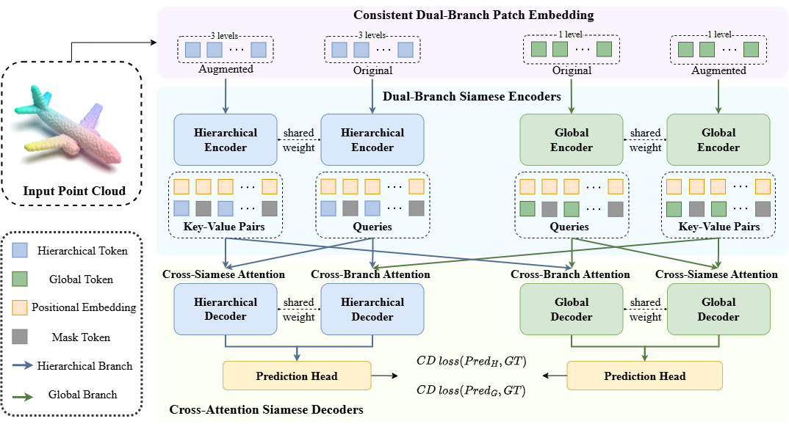

# DS-MAE


## DS-MAE: Dual-Siamese Masked Autoencoders for Point Cloud Analysis
<div  align="center">    
 
 <p>Figure 1: Overview of the proposed DS-MAE.</p>
</div>

## 🔍 Introduction
In this paper, we propose a novel Dual-Siamese Masked Autoencoder (DS-MAE) framework that explores to integrate global and hierarchical feature learning in a unified architecture for point cloud analysis. In particular, we introduce a Consistent Dual-Branch Patch Embedding strategy to partition the point cloud into patches using shared group centers, ensuring both global and hierarchical branches process point patches centered at the same spatial locations. Each branch employs Dual-Branch Siamese Encoders to process original and augmented point patches, learning representations that capture both local details and global context. In addition, we design Cross-Attention Siamese Decoders to reconstruct masked point patches and align features both within and across branches with cross-attention mechanisms. Comprehensive experiments demonstrate our method consistently achieves superior results to prior methods.

## Requirements
PyTorch >= 1.7.0 < 1.11.0;
python >= 3.7;
CUDA >= 9.0;
GCC >= 4.9;
torchvision;

```
# Quick Start
conda create -n dsmae python=3.10 -y
conda activate dsmae

# Install pytorch
conda install pytorch==2.0.1 torchvision==0.15.2 cudatoolkit=11.8 -c pytorch -c nvidia
# pip install torch==2.0.1+cu118 torchvision==0.15.2+cu118 -f https://download.pytorch.org/whl/torch_stable.html

# Install required packages
pip install -r requirements.txt
```

```
# Install the extensions
# Chamfer Distance & emd
cd ./extensions/chamfer_dist
python setup.py install --user
cd ./extensions/emd
python setup.py install --user
# PointNet++
pip install "git+https://github.com/erikwijmans/Pointnet2_PyTorch.git#egg=pointnet2_ops&subdirectory=pointnet2_ops_lib"
```

## Datasets

We use ShapeNet, ScanObjectNN, ModelNet40, ShapeNetPart and S3DIS in this work. See [DATASET.md](./DATASET.md) for details.

## Pre-training
To pretrain PCP-MAE on ShapeNet training set, run the following command. If you want to try different models or masking ratios etc., first create a new config file, and pass its path to --config.

```
CUDA_VISIBLE_DEVICES=<GPU> python main.py --config cfgs/pretrain/DSMAE.yaml --exp_name <output_file_name>
```
## Fine-tuning

Fine-tuning on ScanObjectNN, run:
```
# Select one config from Scan_OBJ-BG.yaml
CUDA_VISIBLE_DEVICES=<GPUs> python main.py --config cfgs/Scan_OBJ-BG.yaml \
--finetune_model cls --exp_name <output_file_name> --ckpts <path/to/pre-trained/model> --seed $RANDOM


# Test with fine-tuned ckpt
CUDA_VISIBLE_DEVICES=<GPUs> python main.py --test cls --config cfgs/Scan_OBJ-BG.yaml \
--exp_name <output_file_name> --ckpts <path/to/best/fine-tuned/model>
```
Fine-tuning on ModelNet40, run:
```
CUDA_VISIBLE_DEVICES=<GPUs> python main.py --config cfgs/modelnet40.yaml \
--finetune_model cls --exp_name <output_file_name> --ckpts <path/to/pre-trained/model> --seed $RANDOM

# Test with fine-tuned ckpt
CUDA_VISIBLE_DEVICES=<GPUs> python main.py --test cls --config cfgs/modelnet40.yaml \
--exp_name <output_file_name> --ckpts <path/to/best/fine-tuned/model>
```
Voting on ModelNet40, run:
```
CUDA_VISIBLE_DEVICES=<GPUs> python main.py --test cls --config cfgs/modelnet40.yaml \
--exp_name <output_file_name> --ckpts <path/to/best/fine-tuned/model> --seed $RANDOM --vote
```

## Visualization
Simple visualization, run:
```
python main.py --config cfgs/pretrain/base.yaml --vis --exp_name final_vis \
--ckpts <path/to/pre-trained/model> --test
```

In addition to the simple method mentioned above for visualizing point clouds, we use the [PointFlowRenderer](https://github.com/zekunhao1995/PointFlowRenderer) repository to render high-quality point cloud images.


## Acknowledgements

This codebase is built upon [Point-MAE](https://github.com/Pang-Yatian/Point-MAE), [Point-M2AE](https://github.com/ZrrSkywalker/Point-M2AE), [ReCon](https://github.com/qizekun/ReCon), [Pointnet2_PyTorch](https://github.com/erikwijmans/Pointnet2_PyTorch).
